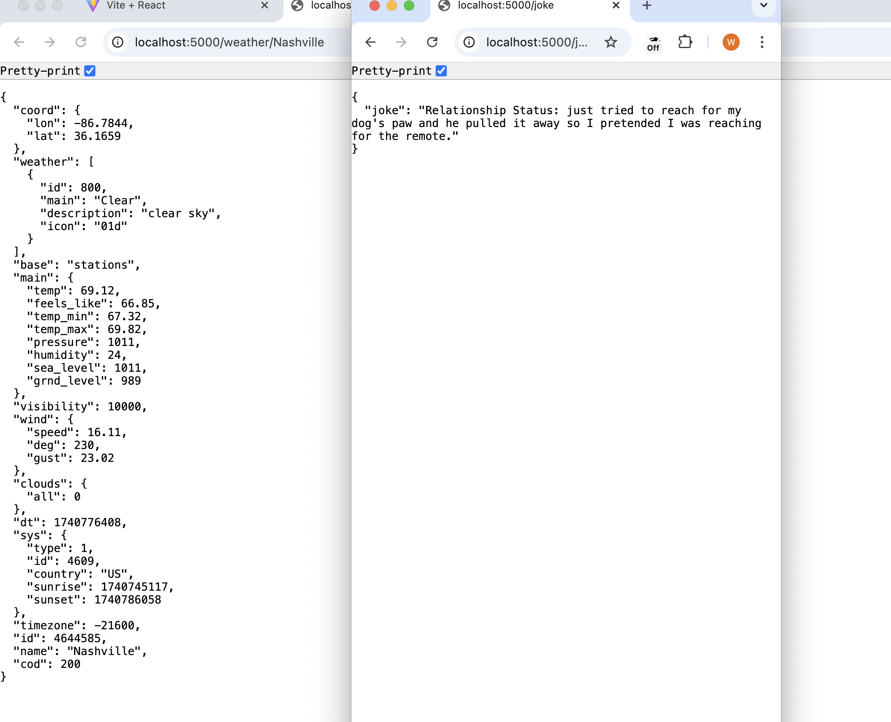

# Weather API App
This is a small weather api app that pulls data from the opensource weather api website. Users can pick any city and receive a fun surprise with every new reload! 

## Table of Contents
  1. [Objectives](#objective)
  2. [Prerequisites](#prerequisites)
  3. [Step by step to clone](#clone)
  4. [Things to install](#install)
  5. [Setting up your api key](#apikey)
  6. [How to run this](#run)
  7. [What you should see](#see)
  8. [Some nice things to have in the future](#niceToHaves)
## OBJECTIVE: <a name="objective"></a>
We will be using the [Open Weather API](https://openweathermap.org/api) and the [Joke API](https://v2.jokeapi.dev/) as well. 
## Prerequisites: <a name="prerequisites"></a>
- [ ] API
- [ ] OauthToken
- [ ] You do need your own API token for the weather app, you will not need one for the jokes API.
## Clone your project <a name="clone"></a>
  `git clone https://github.com/wk642/weather-api.git`
## Things to install to run the project <a name="install"></a>
- [ ]`npm install`
- [ ]`npm install dotenv`
- [ ]`npm install express`
- [ ]`npm install cors`
## Setting up your api key <a name="apikey"></a>
1. goto [OpenWeatherAPI](https://openweathermap.org/api);
2. Click on [Sign Up](https://home.openweathermap.org/);
3. Set up account with a userName, email and password. 
4. After you are done, wait for an email with your api key in it. 
5. Go back to your code editor. 
6. Create a file called `.env`
7. Inside `.env`  put:
    ```
    WEATHER_API_KEY = YourAPIKey
    ```
8. Goto your .gitignore and add `.env`
9. When you do git status, you should not see the .env file, but you should see .gitignore. 
## How to run this <a name="run"></a>
 - For backend  
  `npm run server`  
  
    To make sure the connection is working   
    Go to `localhost:5000/api`  
      
    To see the weather data in JSON   
    Go to `localhost:5000/weather/:city`  
    Please replace `city` with your own city
      
    To see the weather data in JSON   
    Go to `localhost:5000/jokes`  

  - For Front End  
  `npm run dev`  
    Go to `http://localhost:5173/`

## What you should see <a name="see"></a>
Here's a demo:
  

What the backend looks like: (weather on the left side, jokes on the right)

## Some nice to have in the future <a name="niceToHave></a>
- [ ] change the entire theme of the website based on weather
- [ ] display an avatar that will dress accordingly to the weather <- inspired by the fact that my kiddo will "check the weather" and then dress the opposite
